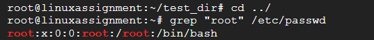
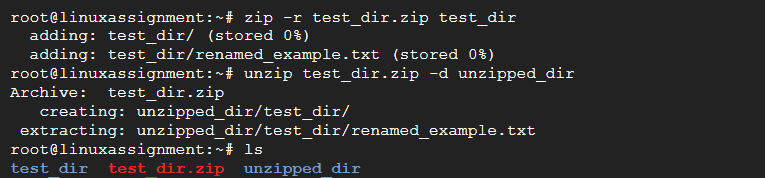
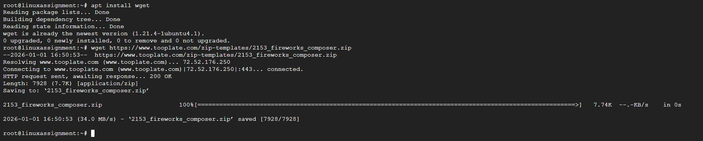
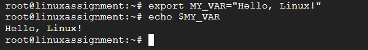

# Linux Commands Practice 🚀

This repository contains a set of Linux command exercises with explanations and sample outputs.  
It is designed as a hands‑on assignment to practice file management, permissions, environment variables, and more.

---

## 📂 1. Creating and Renaming Files/Directories
```bash
mkdir test_dir
cd test_dir
touch example.txt
mv example.txt renamed_example.txt
```
**Explanation:** Creates a directory, adds an empty file, and renames it.


---

## 📖 2. Viewing File Contents
```bash
cat /etc/passwd
head -n 5 /etc/passwd
tail -n 5 /etc/passwd
```
**Explanation:** Displays the full file, first 5 lines, and last 5 lines.  


---

## 🔍 3. Searching for Patterns
```bash
grep "root" /etc/passwd
```
**Explanation:** Finds all lines containing the word **root**.  



---

## 📦 4. Zipping and Unzipping
```bash
zip -r test_dir.zip test_dir
unzip test_dir.zip -d unzipped_dir
```
**Explanation:** Compresses the directory and extracts it into a new directory.  



---

## 🌐 5. Downloading Files
```bash
wget https://example.com/sample.txt
```
**Explanation:** Downloads a file from the given URL.  



---

## 🔒 6. Changing Permissions
```bash
touch secure.txt
chmod 444 secure.txt
```
**Explanation:** Creates a file and sets it to read‑only for everyone.  


---

## ⚙️ 7. Working with Environment Variables
```bash
export MY_VAR="Hello, Linux!"
echo $MY_VAR
```
**Explanation:** Sets and verifies an environment variable.  



---


## ✅ Author
- **Name:** Sandeep Thontla  
- **Role:** Senior Cloud Engineer & DevOps/SRE Consultant  
- **Focus:** Multi‑cloud automation, CI/CD pipelines, reusable technical resources  
```
